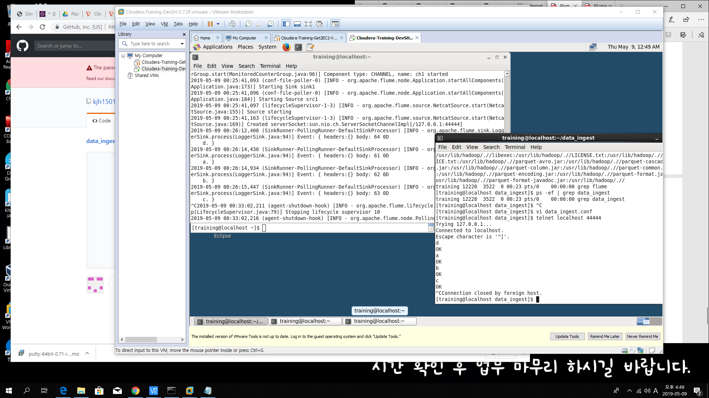
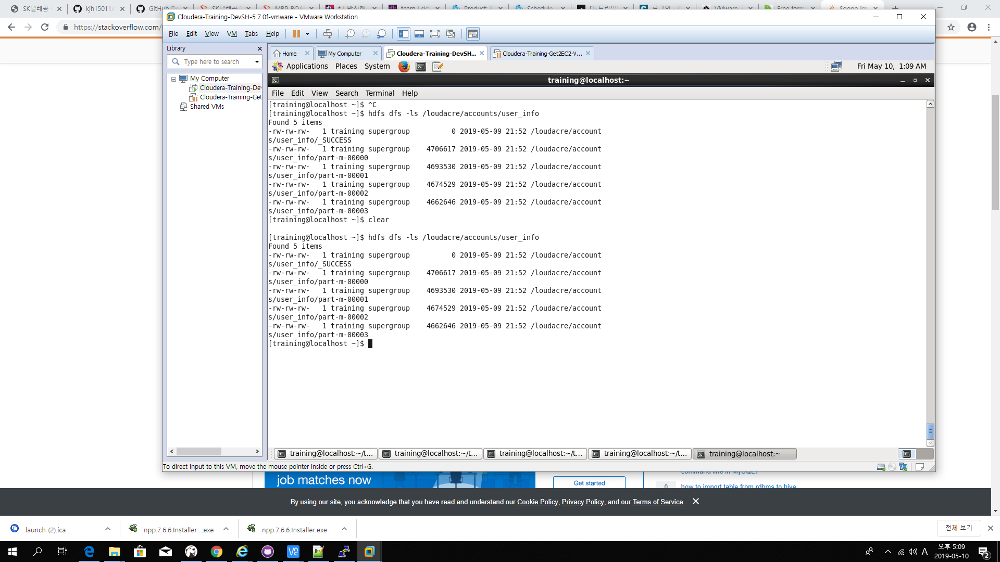
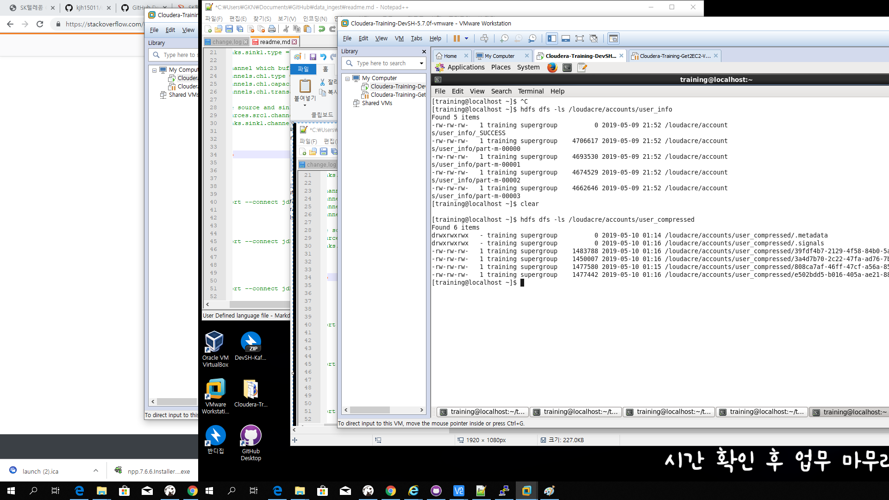

# Flume_Kafka Class (Jeewoong Seong Output)

## day one

### flume netcat



```

agent1.sources = src1
agent1.sinks = sink1
agent1.channels = ch1

# Describe/configure the source
agent1.sources.src1.type = netcat
agent1.sources.src1.bind = localhost
agent1.sources.src1.port = 44444

# Describe the sink
agent1.sinks.sink1.type = logger

# Use a channel which buffers events in memory
agent1.channels.ch1.type = memory
agent1.channels.ch1.capacity = 1000
agent1.channels.ch1.transactionCapacity = 100

# Bind the source and sink to the channel
agent1.sources.src1.channels = ch1
agent1.sinks.sink1.channel = ch1

```

## day two(TEST)


### 01
```
sqoop import --connect jdbc:mysql://localhost/loudacre --username training --password training --table accounts --target-dir /loudacre/accounts/user_info --null-non-string '\\N'
```

### 02

```
sqoop import --connect jdbc:mysql://localhost/loudacre --username training -P --table accounts --target-dir /loudacre/accounts/user_compressed --compression-codec org.apache.hadoop.io.compress.SnappyCodec --as-parquetfile
```


### 03

```
sqoop import --connect jdbc:mysql://localhost/loudacre --username training -P --table accounts --where "state = California" --target-dir /loudacre/accounts/CA --compression-codec org.apache.hadoop.io.compress.SnappyCodec --as-parquetfile
```